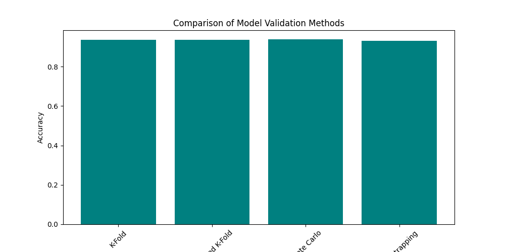
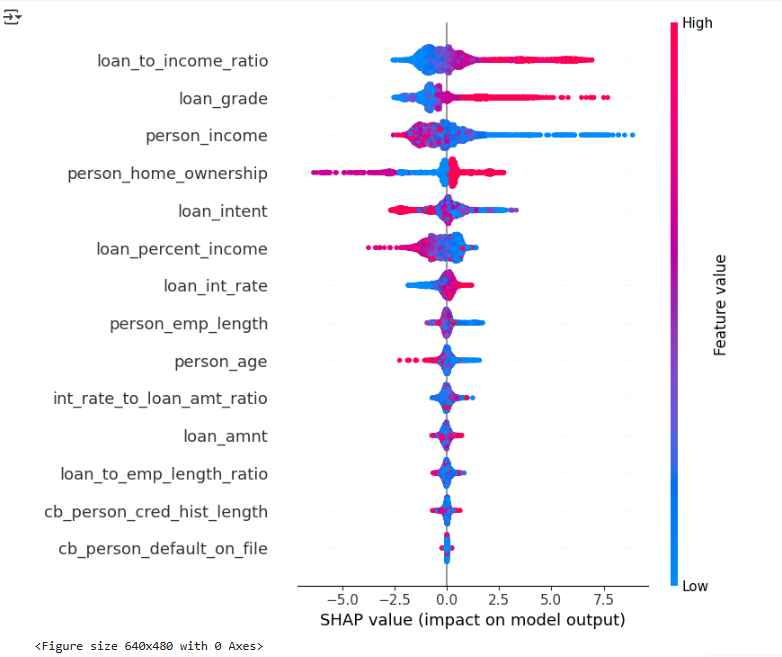
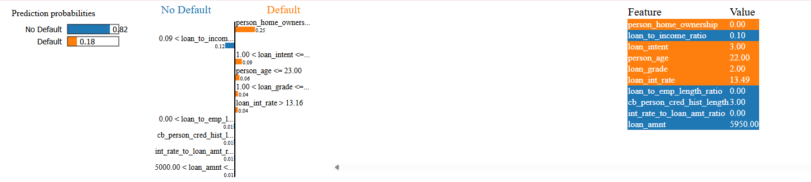

# **Credit Risk Analysis, Prediction & Explainability**
🚀 **A machine learning project for predicting loan defaults with validation techniques and explainability using SHAP & LIME.**  

---

## **📌 Project Overview**
This project builds a **credit risk prediction model** using **machine learning** to classify loan applicants as **defaulters or non-defaulters**. The model is validated using **multiple validation techniques** and **interpreted using SHAP & LIME** to explain predictions.

---

## **📂 Dataset**
The dataset contains **loan applicant information** with features such as:  
- **Personal details** (Age, Income, Employment Length)  
- **Loan details** (Amount, Interest Rate, Grade, Intent)  
- **Credit history** (Default on File, Credit History Length)  
- **Credit history** (Default on File, Credit History Length)  **Loan status** (`0 = No Default, 1 = Default`)  

📌 **Dataset Source**: Public credit risk datasets from **Kaggle / Lending Club / Home Credit**.

---

## **🔍 Data Analysis**
We conducted **exploratory data analysis (EDA)** to understand the dataset structure and detect any inconsistencies.

### **✔ Steps in Data Analysis**
1. **Missing Value Handling**  
   - Filled missing values for `person_emp_length` with **median**.  
   - Replaced missing values for `loan_int_rate` with **mean**.  

2. **Outlier Removal**  
   - Removed **age > 80** (unrealistic for loan applicants).  
   - Removed **employment length > 60** (not practical).  

3. **Feature Engineering**  
   - **Loan-to-Income Ratio** = `loan_amnt / person_income`  
   - **Loan-to-Employment Length Ratio** = `person_emp_length / loan_amnt`  
   - **Interest Rate-to-Loan Ratio** = `loan_int_rate / loan_amnt`  

4. **Class Imbalance Handling**  
   - Applied **SMOTE (Synthetic Minority Oversampling Technique)** to balance default & non-default cases.  

---

## **🧪 Model Training & Validation**
To ensure **robust performance**, we trained multiple models and validated them with different techniques.

### **✔ Models Used**
- **Random Forest**  
- **XGBoost**  
- **Stacking Classifier** (combining models for better predictions)  

### **✔ Validation Techniques**
| Validation Method      | Purpose |
|------------------------|---------|
| **K-Fold Cross-Validation** | Splits data into `K` parts for multiple evaluations. |
| **Stratified K-Fold** | Ensures each fold maintains class distribution. |
| **Monte Carlo Validation** | Randomly resamples data multiple times. |
| **Bootstrapping** | Estimates model uncertainty with repeated sampling. |

📊 **Validation results are plotted for easy comparison.**  

## 📊 Model Explainability: SHAP & LIME

To make the predictions **interpretable**, we used **SHAP (global feature importance)** and **LIME (local instance-level explanations).**

---

### 🔹 SHAP (Global Model Insights)
SHAP (SHapley Additive Explanations) helps **understand how each feature influences the model's predictions** by assigning an impact value to each feature.

- **Higher SHAP value** → Greater influence on model decisions.
- Features such as **loan-to-income ratio, credit history length, and loan grade** were among the most influential.
- The SHAP summary plot provides an **overview of feature importance and impact direction**.

🖼️ **Generated SHAP Plot**  

---

### 🔹 LIME (Instance-Specific Explanations)
LIME (Local Interpretable Model-Agnostic Explanations) explains **why a specific applicant was classified as a defaulter or non-defaulter**.

- Identifies **which features pushed the prediction toward default or non-default**.
- Provides **local interpretability**, showing how changes in feature values affect a specific prediction.
- Useful for **loan officers, financial analysts, and regulatory auditing**.

🖼️ **Generated LIME Explanation**  

---

## 📌 Key Findings
- **Loan-to-Income Ratio** is the most significant factor in predicting default risk.  
- **Longer credit history** reduces the probability of default.  
- **Higher interest rates** increase the risk of default.  
- **Loan intent (purpose of the loan)** plays a crucial role in classification.  

---

## 📦 Installation & Usage

### 1️⃣ Install Dependencies  
Ensure you have all required libraries installed.

### 2️⃣ Run the Training Script  
Train the model using the preprocessed dataset.

### 3️⃣ Run SHAP & LIME Explainability  
Generate global and instance-specific explanations for the model.

---

## 📌 Future Improvements
🔹 **Deploying a Streamlit Dashboard** for interactive visualization.  
🔹 **Fine-tuning models** for better recall on defaulters.  
🔹 **Testing alternative feature selection methods** to improve model accuracy.  

---

